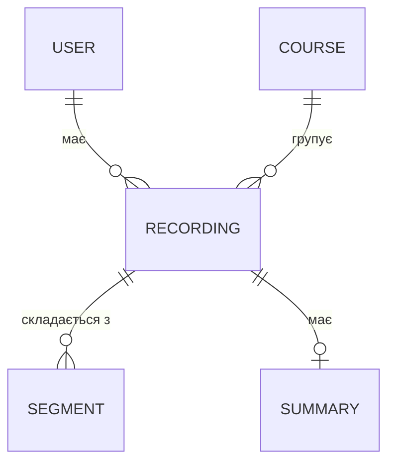

# Модель даних

## Сутності

_Кандидати — підтвердити після Q7, Q10, Q11, Q14._

| Сутність | Опис | Ключові поля |
|---|---|---|
| `User` | Користувач | TBD (Q10) |
| `Course` | Предмет | TBD (Q11) |
| `Recording` | Запис лекції | TBD |
| `Segment` | Фрагмент транскрипту з таймкодами | TBD |
| `Summary` | Конспект запису | TBD (Q7) |

## Зв'язки

Чернетка — оновлювати разом із таблицею.

## Життєвий цикл запису

Статуси `Recording` (пропозиція): `uploaded → transcribing → summarizing → ready`, або `failed`. TBD (Q17).
