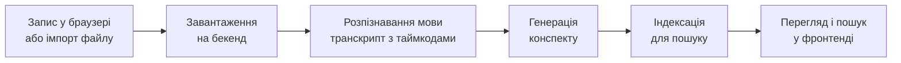

# Архітектура: огляд

## Пайплайн

Суть продукту — один конвеєр обробки. Технології на кожному кроці — в розділі «Стек».



## Компоненти

| Компонент | Відповідає за | Питання |
|---|---|---|
| Фронтенд | Запис та імпорт аудіо, перегляд конспектів, пошук | Q18 |
| Бекенд API | Прийом аудіо, зберігання, видача даних фронту | Q19 |
| Обробник | Розпізнавання й генерація конспекту — синхронно чи фоновою чергою | Q17 |
| База даних | Записи, сегменти, конспекти, пошуковий індекс | Q22 |
| Сховище аудіо | Самі аудіофайли | Q22 |
| Зовнішні сервіси | Speech-to-text, LLM | Q20, Q21 |

## Стек

| Шар | Вибір | Питання |
|---|---|---|
| Фронтенд | TBD — пропозиція: React + TypeScript + Vite | Q18 |
| Бекенд | TBD | Q19 |
| Розпізнавання мови | TBD | Q20 |
| Генерація конспекту | TBD | Q21 |
| База даних | TBD | Q22 |
| Сховище аудіо | TBD | Q22 |
| Деплой | TBD | Q23 |

Кожен вибір фіксуємо окремим ADR у [decisions/](decisions/README.md).

## Ключові рішення

1. Де розпізнавати мову — хмарне API чи локальна модель (Q20).
2. Як генерувати конспект — LLM чи без ШІ (Q21).
3. Обробка синхронна чи фонова з повідомленням «готово» (Q17).
4. Пошук повнотекстовий у БД чи семантичний, на ембедінгах (Q8, Q22).

## Структура репозиторію

TBD (Q27). Пропозиція — монорепо:

```
frontend/   клієнт
backend/    API й обробка аудіо
docs/       документація
```
